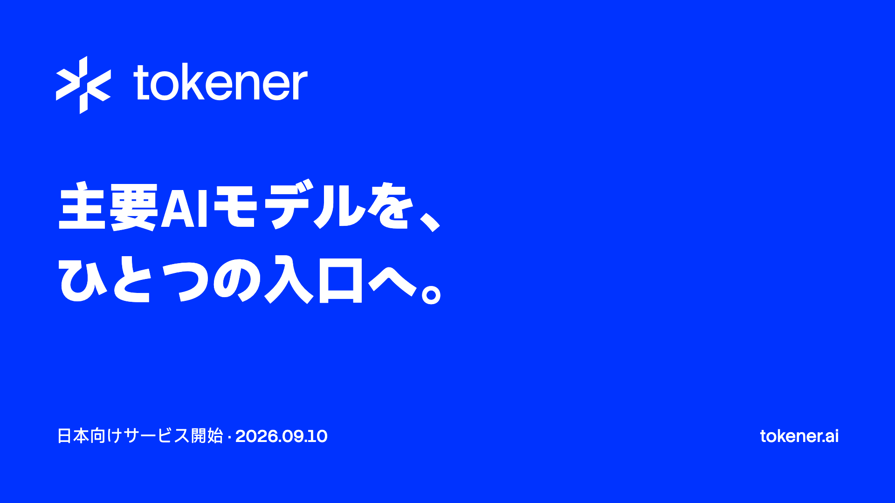

# Tokener promotional video

Editable Remotion project for the Tokener Japan launch presentation on September 10, 2026. The main film is 92 seconds, 1920 × 1080, 30 fps, with Japanese scene titles and no audio.

[Watch or download the film](exports/tokener-ifcon-preview.mp4) · [Cover](exports/tokener-cover.png) · [Presentation script and proposed captions](docs/presentation.md)



## Run and export

Use Node.js 22 or newer and pnpm 11.21.0.

```sh
git clone https://github.com/tokener-ai/tokener-promot-video.git
cd tokener-promot-video
pnpm install --frozen-lockfile
pnpm dev
```

Select **TokenerFilm** in Remotion Studio. Fonts, logos, QR code, and footage are included; rendering needs no product account or API key. The first render may download Remotion's browser.

```sh
pnpm lint
pnpm render
pnpm render:cover
```

Exports are written to ignored `out/`. To reduce memory use, run `pnpm render --concurrency=4`. The checked-in `exports/` files are the shareable film and cover; regenerate and replace them after editing.

## Edit

| File | Purpose |
| --- | --- |
| `src/TokenerFilm.tsx` | Main timeline, scene titles, footage offsets, transitions, coding tools, closing CTA |
| `src/TokenerReveal.tsx` | Brand reveal and model lineup |
| `src/TokenerCover.tsx` | Cover and opening overlay |
| `src/Root.tsx` | Composition dimensions, durations and font loading |
| `src/Composition.tsx` | Standalone intro composition |
| `public/` | Assets referenced by compositions |
| `IFCon-Langenius-Tokener-01-no-subtitle.mov` | Original full-length, full-frame recording |
| `.agents/skills/` | Remotion authoring guidance; not needed to render |

Timeline positions and durations use frames at 30 fps. Footage offsets use seconds. The 1.5-second cover overlays the opening, so it does not extend the film. Additional compositions are **TokenerIntro** (5 seconds), **TokenerReveal** (22 seconds), and **TokenerCover** (still).

The render footage removes 180 pixels from the top of the 3840 × 2160 recording, retaining the bottom product navigation. The original recording is included unchanged. The owner confirmed that the displayed API key is a dummy demonstration value. Demo account and usage information remain visible.

The additional caption track in the script remains proposed; one line is used as a gray scene subtitle during the translation output. Japanese copy needs human review before public presentation. Reconfirm date, price and trial claims before reusing this launch-specific film.

## Rights and assets

This repository retains `UNLICENSED` status; publication does not grant a general open-source license. Contact the repository owner for reuse permission. Third-party fonts and icons retain their own licenses; see [asset attribution](docs/assets.md). Remotion use is governed by its own license.
